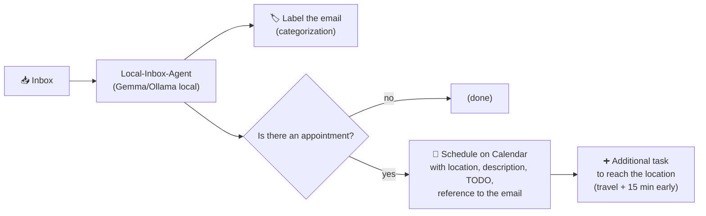
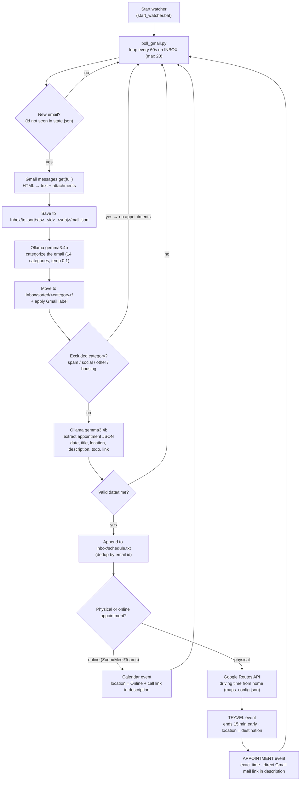

# Local-Inbox-Agent

Local-first Gmail agent — polls your inbox, categorizes emails with a local LLM (Gemma/Ollama), and auto-schedules appointments to Google Calendar. All inference runs offline on your machine.

## What it does



## Why privacy-first

Unlike traditional assistant agents that upload your inbox to a cloud LLM (OpenAI, Anthropic, Google, etc.), this agent works **locally on your device**.

- **100% Offline Processing:** Categorization and appointment extraction are done by a local model ([Gemma](https://ollama.com) via Ollama) at `http://localhost:11434`. Your email text never leaves your computer.
- **Data Ownership:** Your emails and credentials (`token_gmail.json`, etc.) remain on your disk, not on a third-party server.
- **Minimal Surface:** The only network activity is with the Google APIs you explicitly authorize. There is no third-party AI provider in the loop.

## Features

- **Continuous Inbox Polling** — checks your INBOX every 60 seconds and picks up the 20 most recent messages, so nothing is missed even after standby.
- **Local LLM Categorization** — every email is sorted into one of 14 categories by a local Gemma model: spam, social, bills, official communications, purchases, subscriptions, payments, friends & family, work, job offers, events/appointments, housing, important, other.
- **Gmail Labeling** — each categorized email gets the matching Gmail label automatically.
- **Automatic Appointment Detection** — for non-excluded categories, the agent asks Gemma to extract a structured appointment (date, title, location, description, TODO, link).
- **Google Calendar Scheduling** — detected appointments are created as Calendar events with location, description, the TODO note and a direct link back to the original email.
- **Smart Travel Estimation** — for physical appointments, Google Routes estimates driving time from home and creates a separate "Travel to..." event that ends 15 minutes before you need to be there.

## File tree

```
Local-Inbox-Agent/
├── poll_gmail.py              # main poller: INBOX (20) → Gemma 4b → Gmail labels + schedule.txt + Calendar
├── Inbox/                       # created at runtime (gitignored)
│   ├── schedule.txt             # gitignored — extracted appointments (YYYY-MM-DD HH:MM | title | description | TODO)
│   ├── to_sort/                 # gitignored — new emails waiting to be sorted
│   └── sorted/<category>/       # gitignored — sorted emails
├── logs/                        # gitignored — poll.log, apply.log, etc.
├── scripts/
│   ├── backfill.py              # backfill the last N emails
│   ├── categorize.py
│   ├── apply_labels.py
│   ├── create_labels.py
│   └── kill_poll.py
├── example/                     # fictitious sample configs and placeholder emails (incl. to_sort + sorted)
├── start_watcher.bat            # start poll_gmail.py (60s poll + Gemma)
├── stop_watcher.bat             # stop the poll
├── run_poll.bat                 # wrapper with logging
├── state.json                   # gitignored — seen_ids
├── token_gmail.json             # gitignored — OAuth Gmail + Calendar credentials
├── maps_config.json             # gitignored — Routes API key + home address
├── config.example.json          # template for maps_config.json
└── .gitignore
```

## Setup

1. Clone the repo and install the Python dependencies (`pip install -r requirements.txt`).
2. Get a Google Cloud OAuth `client_secret.json` with Gmail and Google Calendar APIs enabled (redirect URI `http://localhost:3000/oauth2callback`). Scopes used: `gmail.readonly`, `gmail.modify`, `gmail.labels`, `calendar`.
3. Make sure Ollama is running locally with the `gemma3:4b` model (`http://localhost:11434`).
4. Copy `config.example.json` to `maps_config.json` and fill in your Google Routes API key and home address (used only to estimate travel time for physical appointments).
5. Run `start_watcher.bat`. On first run it will ask you to authorize Gmail + Calendar access (this writes `token_gmail.json`). Afterwards it runs headlessly.

## Dependencies

**System:** Windows 10/11, PowerShell, Python 3.12, Node.js 18+ (for `gcal.js`), Ollama (`gemma3:4b`).

**Python (pip):** `google-api-python-client`, `google-auth`, `google-auth-oauthlib`, `requests`, `psutil` (see `requirements.txt`).

**Node (npm) in `gcal/scripts`:** `googleapis`.

## Pipeline



## Rules

- **Never sends email** — only `gmail.readonly` / `modify` / `labels`.
- Only `in:inbox` (20-mail buffer). Categories: spam, social, bills, official communications, purchases (real ones only), subscriptions, payments, friends & family, work, job offers (personal only), events/appointments, housing, important, other.
- Job-board emails (Indeed, LinkedIn, Glassdoor) are never classified as "work" — handled deterministically before the LLM.
- Security: all credentials, state, inbox data and logs are gitignored. The `example/` folder contains only fictitious placeholder content, including sample emails waiting to be sorted under `example/emails/to_sort/` and already-sorted ones under `example/emails/sorted/`.

## How to adapt

All personal configuration lives in gitignored files, not in source. The system prompt and identity text live at the top of `poll_gmail.py` — replace the placeholder identity with your own, or restructure it to read from a config file. Paths at the top of `poll_gmail.py` (`CLIENT_SECRET`, `TOKEN_PATH`, `INBOX_DIR`, `GCAL_JS`, etc.) are absolute on the original author's machine; adjust them to your environment, ideally via a `.env` or a centralized config.
